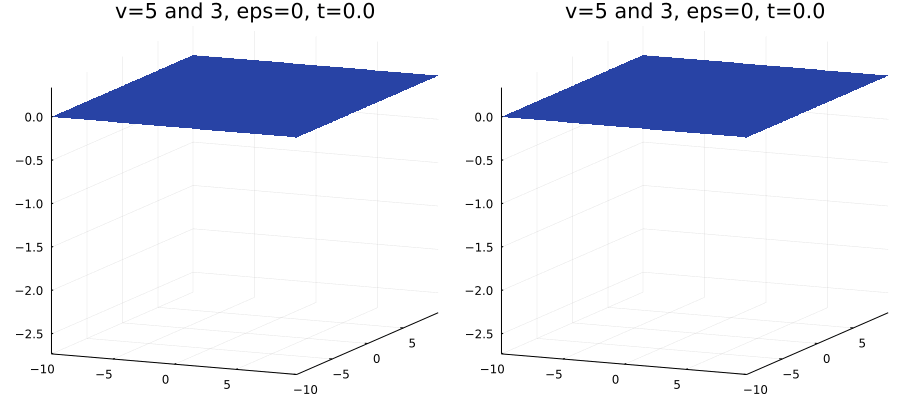

# NeuralFieldEq.jl

| **Docs** | **Build Status** |
|:----:|:----------------------------------------------------------------------------------------------------------------------------------------------------------:|
| Docs |  [](https://codecov.io/gh/tiagoseq/NeuralFieldEq.jl) |

## About

The numerical method implemented in `NeuralFieldEq.jl` was developed within the scope of the thesis [Sequeira 2021](https://fenix.tecnico.ulisboa.pt/cursos/mma/dissertacao/1691203502344856) under the supervision of professor Pedro M. Lima. The method combined the novel numerical scheme published originally by [Hutt & Rougier 2013](https://hal.inria.fr/hal-00872132/document) for delayed NFE in the context of the stochastic scenario presented by [Kuehn & Riedler 2014](https://link.springer.com/content/pdf/10.1186/2190-8567-4-1.pdf) where the convergence of spectral methods was proved in stochastic neural fields with additive white noise and spatial correlation.

Hence, this package aims to numerically approximate solutions of Neural Field Equations in one- or two-dimensional spaces, with or without delay and in the deterministic or stochastic scenarios described below.

## Installation

`NeuralFieldEq.jl` **requires Julia version 1.5 or greater**. You can install Julia [here](https://julialang.org/downloads/). Once installation is complete, open a Julia REPL and run the following code to install the package:
```julia
using Pkg
Pkg.add("NeuralFieldEq")
```

## Dependencies

The package will install the following dependencies `FFTW.jl`, `Distributions.jl` and `LinearAlgebra.jl`.

## Documentation

Please check the [documentation](https://tiagoseq.github.io/NeuralFieldEq.jl) in order to get familiarised with neural field equations and with the solver itself

## Brief overview

The solver is divided into three steps:
- Introduce the parameters and functions using the structures `Input1D` or `Input2D`;
- Pre-process the NFE using the function `probNFE`;
- Solve the equation using the function `solveNFE` at time instants chosen by the user, with or without noise.

With respect to the structures `Input1D` and `Input2D`, they are needed to wrap the inputs needed to define our NFE. They have the following order:
- `α  :: AbstractFloat`: Decay rate
- `v  :: AbstractFloat`: Axonal speed
- `V0 :: fV0`          : Initial condition (constant or a function)
- `L  :: Number`       : Domain's length
- `N  :: Integer`      : Number of spatial nodes
- `T  :: AbstractFloat`: Time span
- `n  :: Integer`      : Number of time nodes
- `I  :: fI`           : External input function
- `K  :: fK`           : Connectivity function
- `S  :: fS`           : Firing rate function

**Remark 1**: The function `I`, depending on the dimensionality of the domain, has to have `x`,`t` or `x`,`y`,`t` as its arguments. Function `K` has `x` or `x`,`y`. Function `S` with `V`.

Once we define our input structure, we can now pass as input to function `probNFE`, where the NFE is prepared to be solved using the function `solveNFE`.

**Remark 2**: Currently, to work with the non-delayed problem, the velocity to insert must satisfy the condition: `v>L/(sqrt(2)*Δt)` in 2D and `v>L/(2*Δt)` in 1D, meaning that in practice the user must specify a big velocity (ex.: ``999999.0``)

### Abstract example:
```julia
nfe  = Input1D(α,v,V0,L,N,T,n,I,K,S); # Wrap the inputs in structure Input1D
prob = probNFE(nfe)                   # Pre-process the NFE to be computed

# Solve the deterministic 1D problem
Vdet = solveNFE(prob,[t1,t2,t3]) # solution saved at t1, t2, and t3

# Solve the stochastic 1D problem np times
# ϵ level of additive noise, spatial correlation (0.1 default value)
Vsto  = solveNFE(prob,[t1,t2,t3],ϵ,np,ξ=0.1)
Vsto2 = solveNFE(prob,[t1,t2,t3],ϵ,np,0.15) # solution w/ xi=0.15 spatial corr 
```
## Example: Neural field with breather type instabilities
```julia
using NeuralFieldEq, Plots

# Define functions
I(x,y,t) = (5.0/(32.0*pi))*exp(-(x^2+y^2)/32.0)
function K(x,y)
    A = 20.0/(10.0*pi)
    B = 14.0/(18.0*pi)
    return A*exp(-sqrt(x^2+y^2)) - B*exp(-sqrt(x^2+y^2)/3.0)
end
S(V) = V<=0.005 ? 0.0 : 1.0 # H(V-th)

# Define parameters
a  = 1.0
V0 = 0.0
L  = 20
N  = 256
T  = 80.0
n  = 1600
tj = 0:0.2:T; # Instants to save the solution

# Wrap inputs and prepare the NFEs to be computed
nfe_v5  = Input2D(a,5.0,V0,L,N,T,n,I,K,S); # Solution with v=5
nfe_v3  = Input2D(a,3.0,V0,L,N,T,n,I,K,S); # Solution with v=3
prob_v5 = probNFE(nfe_v5)
prob_v3 = probNFE(nfe_v3)

# Solve NFEs
V_v5 = solveNFE(prob_v5,tj)
V_v3 = solveNFE(prob_v3,tj)

# Plotting
# Animate the delayed solutions
anim = @animate for i = 1:length(tj)
  p1 = plot(x,y,V_v5(i),st=:surface,title="v=5. t=$(tj[i])",color=:balance,zlims=(-2.8,0.95))
  p2 = plot(x,y,V_v3(i),st=:surface,title="v=3. t=$(tj[i])",color=:balance,zlims=(-2.8,0.95))
  plot(p1,p2)
end
gif(anim, "v5v3_breather.gif",fps=10)
```
